# Курсовой проект: Сервис перевода денег
## Схема приложения
Сервис предоставляет REST-интерфейс для интеграции с FRONT.
Сервис предоставляет интерфейс для перевода денег с одной карты на другую по заранее описанной спецификации.
`Controller` обрабатывает входящие `Post` запросы. Вся бизнес логика в `Service`. `Service` обращается к `Repository` где хранятся все карты в виде объектов `CardEntityStorage`
``` java
public class CardEntityStorage {
    /**
     * Код валюты.
     */
    private Currency currency;
    /**
     * Номер карты.
     */
    private String cardNumber;
    /**
     * Срок действия карты
     */
    private String cardValidTill;
    /**
     * CVV номер.
     */
    private String cardCVV;
    /**
     * Сумма на карте.
     */
    private int balance;

    /**
     * Статус платёжной карт.
     */
    private StatusCardStory status;
}
```
, также обращается к компоненту `Operation`, где хранятся все операции над картами, также к компоненту `Converter`, который осуществляет конвертацию валют если это необходимо.

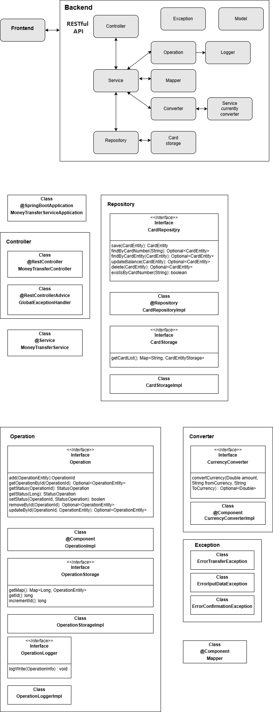

## API для связи frontend и backend
- [Открыть API FRONT](MoneyTransferServiceSpecification.yaml)
- [Описание интеграции с FRONT](frontend/README.md)


## Тестирование приложения
- Тестируем с использаванием `Postman`.

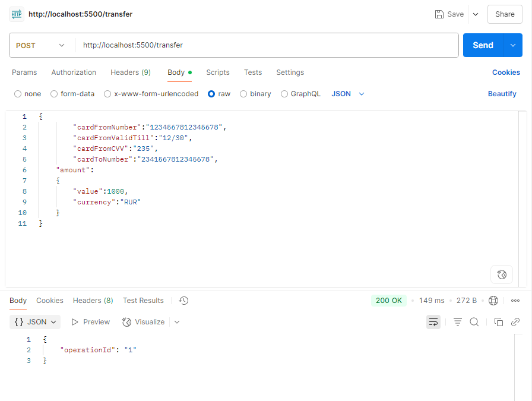

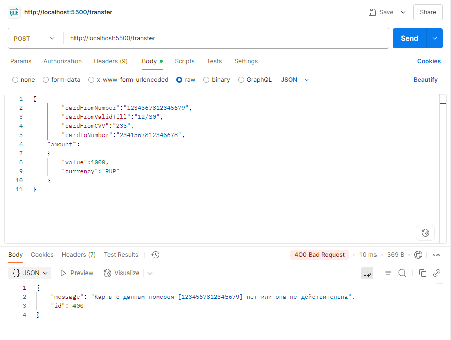

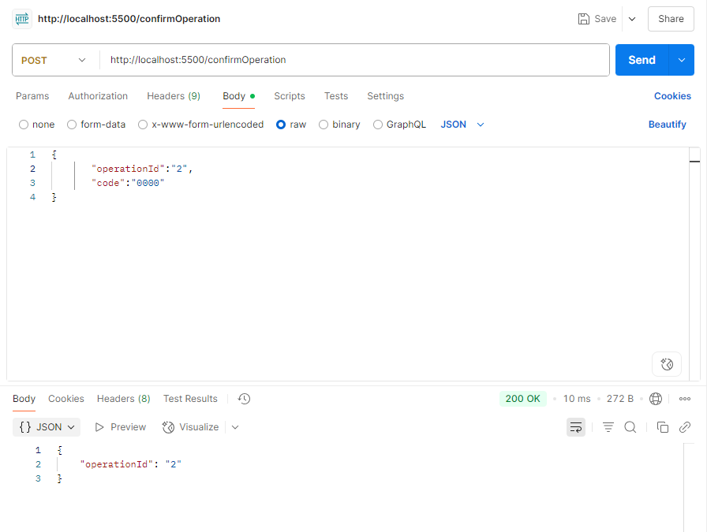

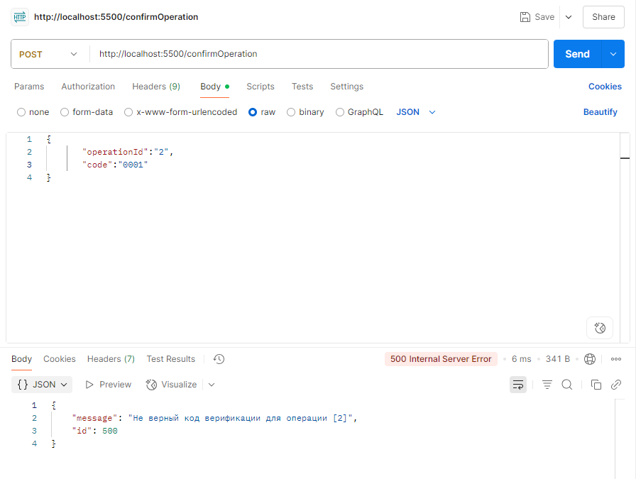

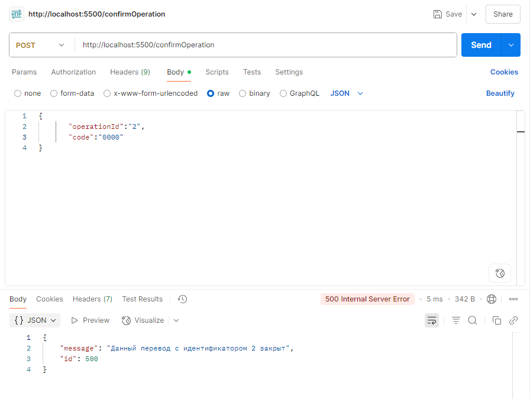
  
- Используем командную строку и команду `curl`.
  На картинке показан пример когда в `PowerShell` введена команда, но приложение отвечает кодом 400. Для поиска проблемы заходим в контейнер и смотрим log.

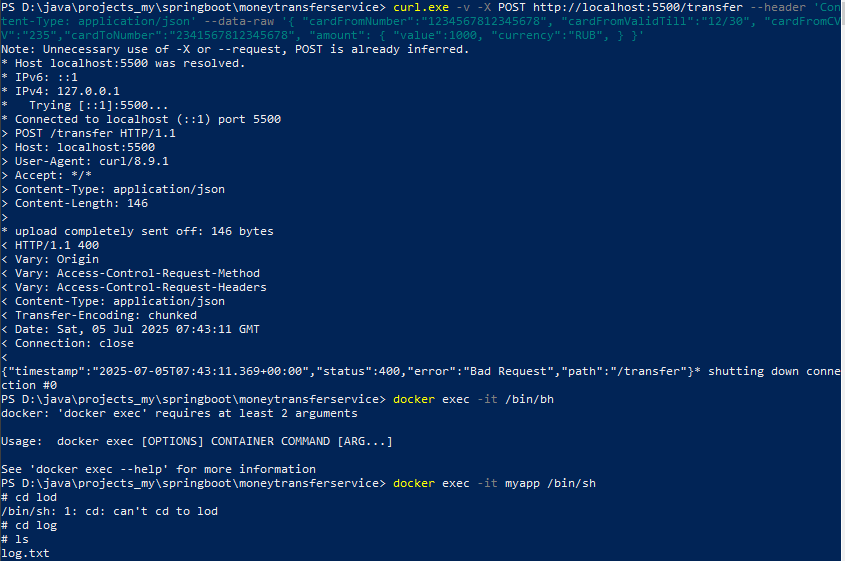
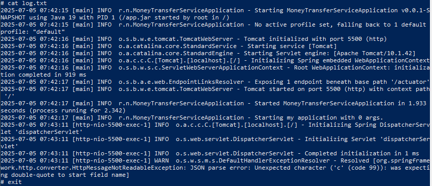

Оказывается PowerShell не видит вложенные символы `"` надо использовать `\"`

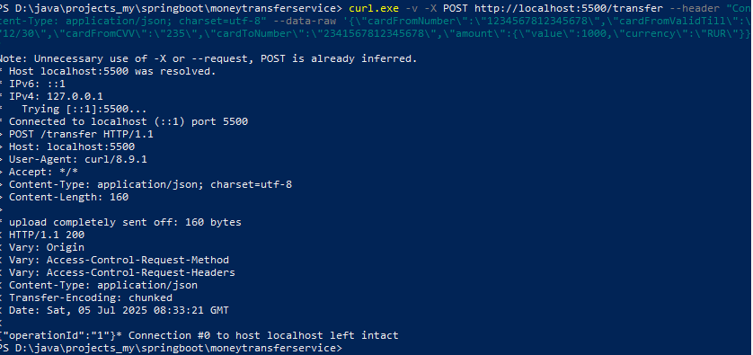

В ответ на запрос приложение отвечает Json пакетом `{"operationId":"1"}`


## Запуск приложения
- Запуск с помощью Docker.
  Делаем clean потом package в проекте или запускаем команду `./mvnw clean package`. 
  Получаем jar файл.
  Создаём в корне проекта файл `Dockerfile`.
  Для совместимости с FRONT приложение работает на порту `5500`.

``` java
FROM openjdk:19-jdk-slim
LABEL authors="Home-PC"

EXPOSE 5500
ARG PATH=target/MoneyTransferService-0.0.1-SNAPSHOT.jar

ADD ${PATH}  app.jar
ENTRYPOINT ["java", "-jar", "/app.jar"]
```
Создаём образ:

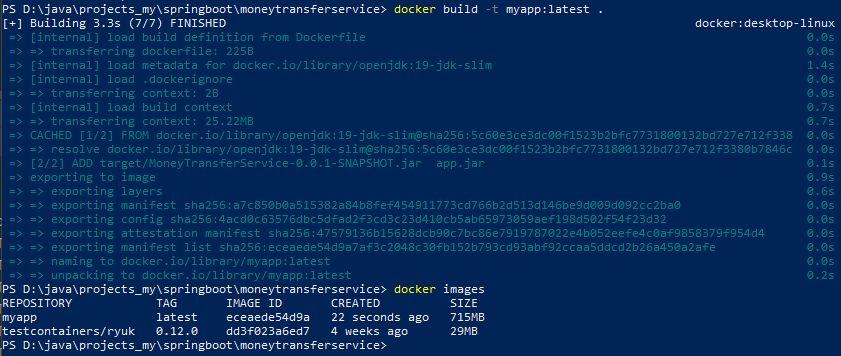

  Запускаем контейнер на порту 5500:

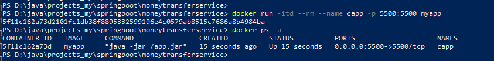

Если надо остановить контейнер:


Удаление образа нашего приложения:

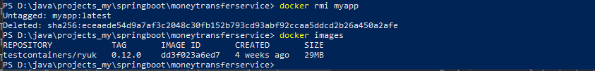

- Запуск с помощью Docker Compose
  Создаём в корне проекта файл `docker-compose.yml`:
``` java
version: '2.35'

services:
  myapp:
    build:
      context: .
    ports:
      - '5500:5500'
    container_name: 'myapp'
```
Создание и запуск контейнера:

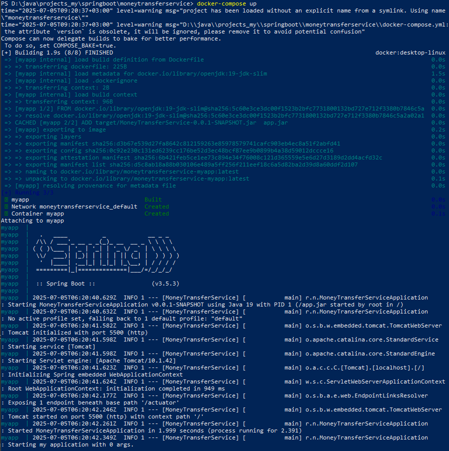

Контейнер запущен:

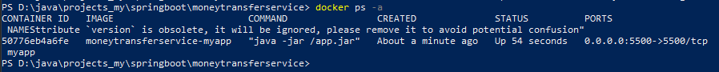

Для остановки и удаления контейнера, при добавлении флага `-v` будут удалены тома связанные с контейнером:

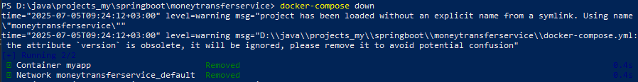

Для запуска в фоновом режиме, чтобы продолжать использовать терминал без привязки к выводу контейнера добавляется флаг `-d`:

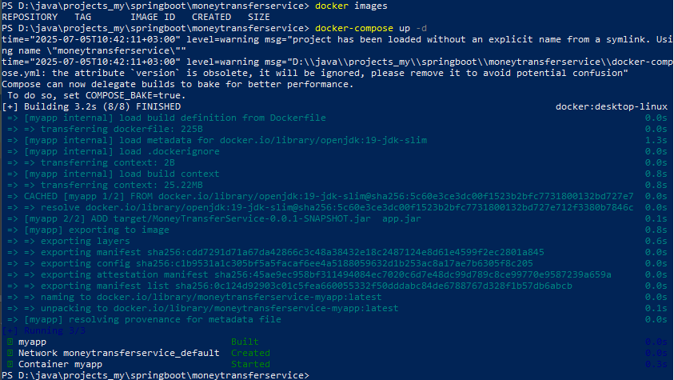


## Пример запросов
Пример POST запроса на инициализацию трансфера денежных средств
``` java
Request URL: http://localhost:5500/transfer
Accept: application/json, text/plain
Content-Type: application/json;charset=UTF-8
Request Payload :
{
  “cardFromNumber”: “1234567812345678”,
  “cardFromCVV”: “232”,
  “cardFromValidTill”: “12/30”,
  “cardToNumber”: “2341567812345678”,
  “amount”: {
  “currency”: “RUB”,
  “value”: 1000
  }
}
Response:
{
  “operationId”:“1”
}
```

Пример POST запроса на подтверждение трансфера денежных средств
``` java
Request URL: http://localhost:5500/confirmOperation
Accept: application/json, text/plain
Content-Type: application/json;charset=UTF-8
Request Payload :
{
  “code”: “0000”,
  “operationId”: “1”
}
Response:
{
  “operationId”:“1”
}
```